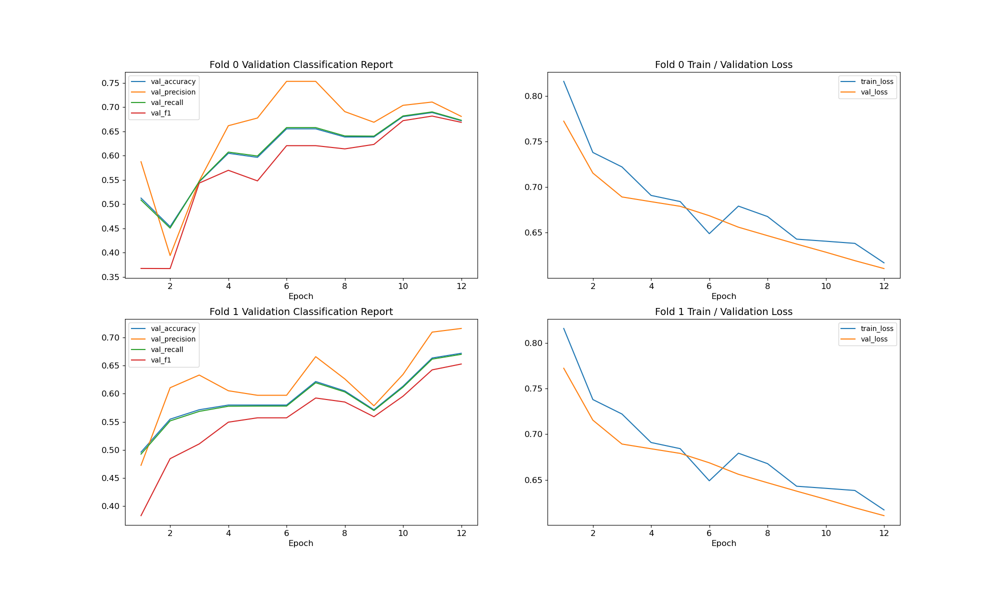
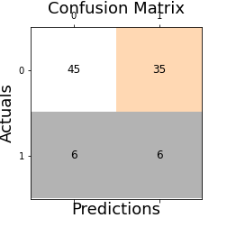
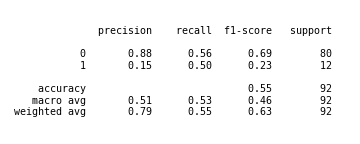

# BERT AITA Classification
BERT Classification of Reddit AITA Question Threads (BERT, NLP, Deep Learning, Keras, Tensorflow, CUDA)
 
 
This is an implementation of BERT (Bidirectional Encoder Representations from Transformers) developed by Google Ai Language using Keras / Tensorflow framework for GPU (CUDA) accelerated computation. 
 
 
Used here for classification of Reddit AITA (“Am I the Asshole?”) questions and their resulting user voted outcomes. Described as *A catharsis for the frustrated moral philosopher in all of us, and a place to finally find out if you were wrong in an argument that's been bothering you. Tell us about any non-violent conflict you have experienced; give us both sides of the story, and find out if you're right, or you're the asshole.* AITA invites users to post their questions and receive the wisdom of the masses who “vote” on outcomes including “Not the Asshole” and “You’re the Asshole” (NTA and YTA respectively).
 
 
The top voted responses (excluding “update”, “meta” or moderator posts) serve as the label target for the BERT classification task. In summary, classification accuracy of 67% is achieved on the training set after 12 epochs using a single local GPU (RTX 2060 Super) limiting sequence length to 16, and batch size of 32. 
 
 

 
 
Despite reasonable training performance, the model did not generalize well and performed poorly on the testing set with an accuracy of just over a coin flip (55%). This model over classify A-holes, suggesting that either BERT is "hangry" and needs a snack (more data) or has decided to take frustrations from its own inadequacy out on others (and needs additional performance tuning). 
 
 

 
 

 
 
In order to improve BERT’s temperament I’d like to introduce a larger corpus, perhaps using a different scraping method. Performance of the PRAW API began to suffer at over 500 threads and responses. Additional performance characteristics may also be evaluated (epochs, batch size, moving to a single validation cohort)
 
 
References throughout the project:
[NLP With Disaster Tweets](https://www.kaggle.com/gunesevitan/nlp-with-disaster-tweets-eda-cleaning-and-bert#0.-Introduction-and-References)  
[Disaster NLP: Keras BERT using TFHub](https://www.kaggle.com/xhlulu/disaster-nlp-keras-bert-using-tfhub)  
[In-Depth Guide to Google's BERT](https://www.kaggle.com/ratan123/in-depth-guide-to-google-s-bert)  
 
And also [PRAW](https://praw.readthedocs.io/en/latest/) the Python reddit API wrapper used for scraping questions and responses. (Not yet included in this repo)

